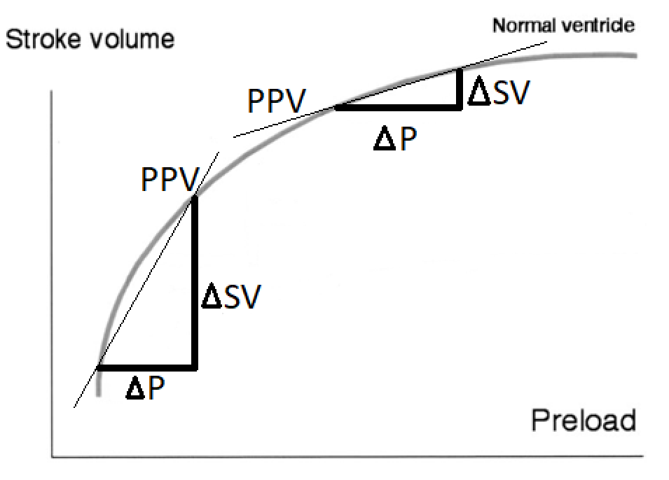

# Introduction and Motivation
This vignette will show why VitalDBR is useful if you want to do statistical analysis on data from VitalDB. VitalDB is a database containing data from more than 6000 patients that have undergone surgery at a hospital in South Korea. The core data set is comprised by waveform data (e.g. blood pressure recordings acquired at 500 Hz) which are  captured during the surgical procedures, but different pre-operative data is also available, such as preoperative laboratory tests, demographics and comorbidities. In addition, some post-operative data is also available, including outcome measures such as in-hospital mortality and post-operative length of stay in the hospital's intensive care unit (ICU). The vignette is split into different parts.
First of all we want to prepare the data for analysis in R. This is a basic need because there are no current resources available in the scientific community that offers a platform to interact with the data using R. The data we are interested in is the Arterial Blood Pressure (ART) and the Airway Pressure (AWP). We subset filter and detect events for this data through signal processing. 
After that we show how to use the processed data and detected events to fit a Generalized Additive Model (GAM) and extract the pulse pressure variation. 
In the end we extend the use case to a novel investigation into the importance of the Pulse Pressure Variation (PPV) on whether it influences patient's time spent in the ICU after surgery. PPV is a variable that is widely used to guide the management of intravenous fluid administration, because it reflects to which extent the heart can handle more intravenous fluid. If PPV is high, the patient's heart can accomodate more fluid administration and it will pump better - this will often be beneficial - whereas when PPV is low, fluid administration is not beneficial and it will generally only carry the risk of side effects, such as edema. To do this we fit a GAM for every other minute during operation and see the proportion of those outside the interval $5 \leq PPV \leq 8$. 
When the dataset is built, we use the results to do regression analysis with the icu-days as the dependent variable and PPV and known risk factors of prolonged ICU-stay (e.g age, bmi and preoperative health) as independent variables. We explore generalized linear models with different likelihood distributions: Poisson, Negative binomial and Compound Poisson, Zero-inflated Poisson, and Negative binomial models. We do model diagnostics and determine which models are best suited, and finally compare the suited models using various metrics.

## Physiological background

When patients at hospitals undergo general anesthesia they will be put in mechanical ventilation, where a machine breathes for the patient. Normally breathing consists of muscles in one's torso pulling down, which makes the lungs expand, thus creating low pressure in the lungs that draws the higher pressure atmospheric air into them. When a patient undergoes general anesthesia and gets mechanical ventilation this is not the case. As air is pushed down into the lungs the pressure rises inside, and certain things involving the heart become different. For one, the RV and LV preload become lower during mechanical ventilation. RV and LV mean right ventricular and left ventricular, which are chambers of the heart that push blood to the lungs and the rest of the body, respectively. You can think of preload as the heart loading up for the next time it will contract and push blood out into the body. Lower preload results in a smaller stroke volume of the heart. It would be less than ideal if the lessened stroke volume of the heart resulted in poor blood circulation or the like. 

To make sure that the heart pumps hard enough to push blood out into the whole body, patients can receive a liquid preload that will aid the heart by heightening its stroke volume. How effective this liquid preload is depends on a patient's position on the Frank-Starling curve, which shows the correlation between preload and stroke volume. The only catch is that the effect of liquid preload lessens the more "pre-filled" the patient already is. This means that it is not always beneficial to inject a patient with low stroke volume with more liquid preload. The reason that PPV is interesting is that it is the slope on the Frank Starling curve, and therefore also acts as an indication of a patient's position on the Frank-Starling curve. This makes PPV a valuable tool in guiding the decision to inject (more) liquid preload or not.

```{r echo=FALSE, out.width='100%'}

```

# Fitting a gam
## Preparing everything
Before we get started, we need a couple of packages. 


```{r message=FALSE, warning=FALSE}
# This is how you install VitalDBR!
##################################################################
library(devtools)                                               
install_github('legendenomgeorg/VitalDBR/VitalDBR', force= TRUE)
library(VitalDBR)                                               
##################################################################

library(comprehenr)
library(kableExtra)
library(knitr)
library(waveformtools) # This is a package made by our advisor PhD. student Johannes
library("tidyverse")
library(mgcv) # The standard R package to use GAM's
library(patchwork) # Package used for plotting
```


Then we need to load some data. For that we have created the function "load_case", which takes in a monitoring machine, the track of interest and finally the caseid. 
```{r}
data_art <- VitalDBR::load_case(tname = 'SNUADC/ART', caseid = 1)
data_awp <- VitalDBR::load_case(tname = 'Primus/AWP', caseid = 1)
```

In this case we load the tracks ART (Arterial Blood Pressure) and AWP (Airway Pressure) for patient 1. ART is recorded by the "SNUADC" analog-to-digital converter and AWP is measured by the "Primus" mechanical ventilator.
Under the hood this function finds all tracks with the inputted caseid and then stitches together the right API call such that we get the the right data. The format of the data also makes it easy to convert to a timeseries format as the frequency is saved in the first row of the first column, like this:

```{r}
tsp(ts(data_art[,2], frequency = 1/data_art[1,1])) # Output is first value (1.00), last value (11541.31) and frequency (500)
```
But we will continue working in the data.frame format for this vignette.

To make sure that we work with the same data through out the first part of the vignette, we start out by defining an interval we want to work on. In our case, we want to work with the interval [10000:10030].

```{r}
start = 10000 # Interval start
length_of_segment_sec = 30 # Length of interval
```


## Finding the inspiration of AWP

Now we introduce our function: "subset_data". This function helps with choosing an interval of a timeseries defined by frequency. It automatically converts sample number to seconds and subsets the data. 
```{r}
sub_awp <- VitalDBR::subset_data(data = data_awp, seconds = length_of_segment_sec, start_sec = start)
knitr::kable(head(sub_awp))
```

We now have the right subset of our AWP data. We have made a function, plot_awp, for beautifully plotting the AWP data where time in seconds is on the x-axis, and the AWP value in hPa is on the y-axis. The function can  also take in the values 'add_insp_start' and 'insp_start_data' which can be used to plot the AWP data in combination with the inspiration starts.

```{r,fig.width = 16}
VitalDBR::plot_awp(awp_data = sub_awp)
```

Now, as stated in the introduction, we are interested in finding the inspiration of the airway pressure, which is the beginning of a breath. For that we have created the functions "get_inspiration_start" and "get_convolution_data". By default, the get_convolution_data() function works by applying a convolution filter of the form (-1,-1,-1,-1,-1,-1,-1,-1,0,1,1,1,1,1,1,1,1) (note: stats::filter takes the convolution filter in reverse, so we input the reverse of this). This creates a waveform which peaks at sudden large, and sustained, changes in AWP. This means that we can use a standard peak-finding algorithm on the convolution, to find the inspirations.

First, we get the convolution output signal from the AWP data
```{r}
convolution_data <- VitalDBR::get_convolution_data(sub_awp)
```

Next, we plot the convolution output signal. The maximums indicate inspiration starts!
```{r,fig.width = 16}
VitalDBR::plot_convolution_data(convolution_data)
```

We now detect the maximum points from the convolution data.
```{r}
insp_start <- get_inspiration_start(convolution_data)
```

The function returns the times of the peaks in a dataframe and we can then plot the inspirations on the AWP signal:
```{r,fig.width = 16}
VitalDBR::plot_awp(awp_data = sub_awp, add_insp_start = 'yes', insp_start_data = insp_start)
```

## Finding the diastolic and systolic peaks of the Arterial Blood Pressure (ART)
To find the diastolic and systolic peaks of the Arterial Blood Pressure (ART) we first subset the data, to the same interval as before. But the noise in the ART data can disturb our ability to find the peaks properly. Luckily you can give "subset_data" an optional argument called "filter". If the filter argument is set to TRUE, it applies a low-pass Butterworth filter to the data. The result can be seen if you zoom into the plot below (interactively!). We can also set the cutoff frequency for the filter with the argument "cut_freq" (default is 25 Hz, which should retain all physiologically relevant signal). 

```{r}
sub_art <- VitalDBR::subset_data(data = data_art, seconds = length_of_segment_sec, start_sec = start, filter=TRUE, cut_freq = 25)
knitr::kable(head(sub_art))
# mote that the first few values are a bit out of sync, but that is due to the nature of a lowpass filter, it has to "dial in" before it is accurate. 
```

```{r}
dygraph_signal(sub_art, 2, 3)
```

Now that the data is prepared we use a function created by our advisor Johannes, that finds the value and position of the peaks. It also finds the pulse pressure, which is just the difference between the systolic (SBP) and diastolic (DBP) blood pressure: PP = SBP - DBP
```{r message=FALSE, warning=FALSE}
beats <- waveformtools::find_abp_beats(sub_art,abp_col=3,time_col=1)[-1,] # we skip the first observation
knitr::kable(head(beats)) %>% scroll_box(width = "100%")
```

Now we plot the Arterial blood pressure, together with the beats and the inspiration:
```{r fig.width = 16, fig.align="center"}
VitalDBR::plot_art(sub_art, insp_start, beats)
```
Beautiful, right? 

We can also plot the pulse pressure with the inspiration. NOTE: As the pulse pressure is a discrete measurement, this is plotted with a linear line interpolation.
```{r fig.width = 16, fig.align="center"}
VitalDBR::pp_plot(insp_start, beats)
```

But we want to know which inspiration every pulse pressure measurement belongs to, and we want to know the position of the pulse pressure measurement relative to the inspiration. To do this we use a function created by our advisor Johannes, that adds "ann_n" which says which inspiration a measurement belongs to. And "ann_rel_index" which gives the position relative to the inspiration (ie. it goes from 0 to 1 between each inspiration)
```{r}
beats_indexed <- waveformtools::add_time_since_event(beats, time_event = insp_start$time)
knitr::kable(head(beats_indexed)) %>% scroll_box(width = "100%")
```


This plot then colors the pulse pressure measurements according to which inspiration they belong to. 

```{r fig.width = 16, fig.align="center"}
VitalDBR::pp_plot_color(beats_indexed, insp_start) + ggtitle('Pulse Pressure') + theme(plot.title = element_text(size = 40))
```


On the right plot we can also start to see why this is important. It seems that there is a relationship between inspiration and pulse pressure. This is the relationship we want to model with the GAM framework.
```{r fig.align="center", fig.width=14, warning=FALSE}
pp_plot_color_and_index(beats_indexed, insp_start)
```


## Fitting the GAM

### The theory behind Generalized Additive Models
The reason we use GAMs is that they do not assume a linear relationship between independent and the dependent variables. Instead, a GAM allows describing the effect of an independent variable a smooth function. The reason it is useful for our analysis, is that we have two different shapes that we want to isolate. The first is the cyclic shape of the pulse pressure, from which we will extract the pulse pressure variation. And the other is the time trend over the entire interval. 


Generalized Additive Models have two magical properties. The first is the fact that we do not need to know the shape of the predictive functions a priori, since the splines can represent any smooth function. Regularization is applied to combat overfitting.

A spline is a function defined piecewise by polynomials. A spline's order is defined from the order of polynomials you want to fit for every "piece" of the interval and where the number of pieces are defined by the amount of knots.

In our case we choose cubic $x^3$ polynomials, since they are not very "wiggly" and generally result in nice smooth splines.

We also choose to create the spline with 10 knots. This choice was a compromise between computability and interpretability. A low number of knots will give a bad representation of the shape, as it is not detailed enough. But a too large amount of knots will just result in redudant computing, as we are trying to fit more polynomials than actually needed to create a decent spline representation of the underlying data.

The next magic property is the fact that it is an additive model. When a model is additive, the interpretation of the marginal impact of a single variable does not depend on the values of the other variables in the model. This means that we can interpret the coefficients similarly to a normal linear regression, although we do not have a use for this in this vignette. 

We can generally write the GAM structure as:
$$g(E(Y))=α+s_1(x_1)+⋯+s_p(x_p)$$
In our case this would all translate to:
$$g(E(PP))=α+s_1(ann\_rel\_index)+s_2(Time)$$
Where $s_1$ is a cyclic cubic spline and $s_2$ is a normal cubic spline, as stated above

In this project we use the GAM to find the PPV, by extracting the PPV from $s_1(Ann\_rel\_index)$ without the impact of the time trend $s_2(Time)$. 


[Source for this section](https://multithreaded.stitchfix.com/blog/2015/07/30/gam/)


## Why do we use a GAMs for modelling PPV?
There exists other ways to calculate the PPV of the pulse pressure. They are often based on simpler methods from signal processing /time series analysis, where you calculate min PP, max PP for individual inspirations. They usually perform very well and are widely used for guiding fluid therapy.
The reason we use GAMs are first of all, that this is research and not industry. It has still not been definitively proved that GAM modelling of pulse pressure variation is more clinically useful than the normal methods, but our advisor Johannes' coming phd thesis seems to suggest it.
The visualizations of the GAM modelling results are also extremely useful as model checking. There is also no doubt that the GAM - compared with less advanced methods - offers an efficient way to isolate the effect of respiration on pulse pressure. Finally, considering that the GAM is used for automatic detection at the end of this vignette across thousands of subjects' hour-long recordings, it should be appreciated that the GAM is theoretically less prone to noise artifacts than less advanced methods, simply because the GAM modelling by our design restricts the variation in pulse pressure to "originate" from the respiratory cycle. 

We now defined our GAM and plot the two splines.

```{r}
PP_data <- beats_indexed[,c("PP","time","ann_rel_index")]

PP_gam <- gam(
 PP ~ 
   s(ann_rel_index,k =10,bs = "cc" ) +
   s(time,bs = "cr" ), 
   knots = list(ann_rel_index = c(0,1)),
   method = "REML", 
   data = PP_data)
```


```{r,fig.width = 12}
gratia::draw(PP_gam, residuals = TRUE,   resid_col = "orange", ci_col = "#6378e1",) & theme_classic() & geom_line(colour = '#63A0E1', size = 1)

```

We can also extract the intercept from the model, which is also the mean of the pulse pressure. We need this below to calculate the PPV
```{r}
alpha <- coef(PP_gam)[1] # intercept
alpha
```


Time to calculate PPV
```{r}
calc_PPV <- function(smooth, intercept) {
min_PP <- min(smooth)
max_PP <- max(smooth)
return((max_PP - min_PP) / unname(intercept))
}
splines <- predict(PP_gam, type = "terms") # since no data is provided, it automatically uses the original data.
PPV <- calc_PPV(splines[,1], intercept = coef(PP_gam)[1])
PPV*100
```
First we generate points from the spline with the predict function, then we calculate the PPV from the predicted data with this formula:
$$ PPV = \frac{PP_{max}-PP_{min}}{mean(PP)} = \frac{max(s_1(ann\_rel\_index))-min
(s_1(ann\_rel\_index)))}{\alpha} $$
In the end we see that the pulse pressure is 5.5, which is in the "normal range", as defined by the interval $5 \leq PPV \leq 8$ that we are interested in.

## Summary
To sum up this section of our vignette, we have so far showcased how to interact with the VitalDB API through our function load_case. In our case, we have used the SNUADC/ART and Primus/AWP tracks, but the function also works for other tracknames which can be found [here](https://vitaldb.net/dataset/?query=overview&documentId=13qqajnNZzkN7NZ9aXnaQ-47NWy7kx-a6gbrcEsi-gak&sectionId=h.d0wofkno1fxp). Please note that the function is case sensitive i.e. SNUADC/ART data can't be retrieved when typing SNUADC/art instead. If the specificed trackname and track id isn't valid, you will simply get a 'cannot open the connection to...' error message. 

Next, we showcased how to subset the retrieved data from load_case() in order to work in seconds instead of hertz. With this data, we first determined the inspiration starts by using the AWP data, and then the beats. Afterwards, we plotted the AWP and ART data by using our plot_awp, plot_art and functions, respectively. 

Lastly, we fitted and plotted the GAM with the two splines, $s_1(ann\_rel\_index$ and $s_2(Time)$, and calculated the Pulse Pressure Variation for our specificed interval of the operation with $caseid=1$.


*NOT DONE*

# Does PPV influence the number of days a patient spend in the ICU?
This part of the vignette revolves around utilizing what we have previously done, to better understand whether the Pulse Pressure Variation (PPV) during an operation influences the days spent in the ICU.

## Creating the dataset
To create the data set we need to calculate the PPV for every other minute of every operation... That is a lot of calculation! Therefore we have added the final dataset to the repo as "df.csv" such that you do not have to spend sleepless nights hoping that R doesn't crash during it's 1147th iteration.

But before we can calculate the PPV we need to restrict our dataset to the following criteria:

  + The surgery approach should be "open"
  
  + The department should be "General surgery"
  
  + The type of anesthesia should be "General"
  

The reasons for this is that some limitations exists regarding the use and interpretation of PPV. Particularly, some procedures are not associated with the "right" type of ventilation and the ventilator settings. Also, videoscopic procedures (that are not "open") such as those where air is blown into the stomach to create space for that type of less invasive surgery, creates increased pressure in the abdominal region, which also changes PPV physiology. By selecting these procedures, we are sure that these limitations to PPV are not present.

We also add the end and start time of the operation, as we need that later
```{r}
cases <- VitalDBR::load_VDB("https://api.vitaldb.net/cases") %>%
      dplyr::filter(approach=="Open",
                department=="General surgery",
                ane_type=="General") %>%
      dplyr::select(caseid, opstart, opend)
knitr::kable(head(cases))
```

As we know from the first part of this vignette, we need both the Arterial Blood Pressure (ART) and the Airway Pressure (AWP) to calculate the GAM. Therefore we also restrict our data to cases which have both sensors like so:
```{r}
tracks <- VitalDBR::load_VDB("https://api.vitaldb.net/trks") %>%
    dplyr::filter(tname == "Primus/AWP" | tname == "SNUADC/ART") %>%
    count(caseid) %>%
    dplyr::filter(n == 2)
knitr::kable(head(tracks))
```

We then join those two datasets together by their case id, which results in the final dataset:
```{r}
merged <- merge(x=tracks,y=cases,by="caseid") %>% dplyr::select(-one_of("n"))
knitr::kable(head(merged))
```


And now for the part where we combine everything we have done so far to create the dataset we need to be able to do statistical analysis on the effects of the PPV on patients. 
### Calculating PPV
The algorithm below, gets a dataset where it extracts the current caseid. Then it proceeds to load the ART and AWP timeseries belonging to those caseids. Then for each 2 minute intervals it calculates the inspiration, the systolic and diastolic peaks. From those it models a GAM like above and from that GAM it calculates the Pulse Pressure Variation. The PPV is then added to a list, which contains all the PPV measurements from that case. This means that it if the operation is 120 minutes, it creates a list PPV of length 60, from which it calculates the following variables:

* PPV_under5
  + This is a number between 0 and 1, indicating what proportion of the measurements are under 5. 

* PPV_over8
  + This is a number between 0 and 1, indicating what proportion of the measurements are over 8 
  
* PPV_avg_first_30
  + This is the average of the first 15 measurements
  + We measure this to get an indication of the patients PPV pre-operation, as this is not a measure we have from the database
  
* PPV_avg_last_30
  + This is the average of the last 15 measurements
  + We use this to see whether it matters to for example have a lowered PPV as a result of the operation
  
These variables are then used later in the statistical analysis to determine whether they influence the outcome. 
This leads to a discussion on whether these are "good" metrics. The nature of the PPV measurements, mean that we can't include ALL of them. We decided with our advisors, that looking at the proportions under 5 and over 8, were the best compromise. This is because the data originates from recent years, where tidal volume settings are lower compared with 10-20 years ago.

The interval stems from domain knowledge, and we constrain it to the time spent outside the [5;8] interval relative to the entire surgical length, i.e. a number between 0 and 1 as the proportion is more relevant than the amount of measurements below or above.

Here is the algorithm:
```{r}
calc_PPV <- function(smooth, intercept) {
min_PP <- min(smooth)
max_PP <- max(smooth)
return((max_PP - min_PP) / unname(intercept))
}

ppv_prepare <- function(case, start, end, data_art, data_awp){
  # det tager usandsynligt lang tid, så vi skal have fixet den load funktion....
  # men ellers er det bare at implemetere PPV udregningen her
  op <- end - start
  interval <- 120
  iterations <- floor(op/interval)
  
  first30_avg <- 0
  last30_avg <- 0
  
  data <- c(matrix(NA, nrow=iterations+2))
  skip_to_next <- FALSE
  
  for (i in 0:iterations){
        try_catch <- tryCatch(
    {
    sub_awp <- VitalDBR::subset_data(data = data_awp, seconds = interval, start_sec = start+(interval*i))
    insp_start <- VitalDBR::get_inspiration_start(sub_awp)
    sub_art <- VitalDBR::subset_data(data = data_art, seconds = interval, start_sec = start+(interval*i), filter=TRUE, cut_freq = 25)
    beats <- find_abp_beats(sub_art, abp_col=3, time_col=1)
    beats_indexed <- waveformtools::add_time_since_event(beats, time_event = insp_start$time)
    rm(beats)
    PP_data <- beats_indexed[,c("PP","time","ann_rel_index")]
    PP_gam <- gam(
    PP ~ 
    s(ann_rel_index,k = 10, bs = "cc" ) + s(time, k = 10, bs = "cr"), # splines
    knots = list(ann_rel_index = c(0,1)), method = "REML", data = PP_data )
    splines <- predict(PP_gam, type = "terms")
    PPV <- calc_PPV(splines[,1], intercept = coef(PP_gam)[1])*100
    data[i] <- PPV
    
    if (i <= 15){
      first30_avg <- first30_avg + PPV
    }
    if (i > (iterations-15)){
      last30_avg <- last30_avg + PPV
    }
    
    cat("Iteration",i, "out of ", iterations,". For case:",case,"\n")
    rm(PP_data)
    },
    error = function(e){
      skip_to_next <<- TRUE
    }
    )
    if(skip_to_next) { 
      data[i] <- NA
      next 
      } 
  }
  first30_avg <- first30_avg / 15
  last30_avg <- last30_avg / 15
  data[iterations+1] <- first30_avg
  data[iterations+2] <- last30_avg
  
  return(data)
}

process_cases <- function(data){
  ppv_under5 <- data.frame(matrix(NA, nrow = nrow(data)))
  ppv_over8 <- data.frame(matrix(NA, nrow = nrow(data)))
  
  ppv_first30 <- data.frame(matrix(NA, nrow = nrow(data)))
  ppv_last30 <- data.frame(matrix(NA, nrow = nrow(data)))
  
  counter <- 0 
  break_and_save <- FALSE
  for (caseid in data$caseid){
    counter <- counter + 1 
    closeAllConnections()
            try_catch <- tryCatch(
    {
    cat("Importing ART for case:",caseid,"\n")
    art <- VitalDBR::load_case('SNUADC/ART', caseid)
    cat("Importing AWP for case:",caseid,"\n")
    awp <- VitalDBR::load_case('Primus/AWP', caseid)
    },
    error = function(e){
      break_and_save <<- TRUE
      })
            
    if(break_and_save) {
      cat("Something went wrong when loading case:", caseid,"Saving results so far", "\n" )
      break 
      } 
    start <- data$opstart[data$caseid==caseid] # This line and below could be optimized
    end <- data$opend[data$caseid==caseid] # - II -
    ppv_results <- na.omit(ppv_prepare(caseid, start, end, art,awp))
    rm(art)
    rm(awp)
    
    ppv_first30[counter, 1] <- ppv_results[length(ppv_results)-1]
    ppv_last30[counter, 1] <- ppv_results[length(ppv_results)]
    
    # remove first and last 30 mins avg PPV from data vector, only leave PPV's from all 2min iterations
    ppv_results <- ppv_results[0: (length(ppv_results)-2)]
    
    len_ppv <- length(ppv_results)
    ppv_under5[counter, 1] <- sum(ppv_results<=5)/len_ppv
    ppv_over8[counter, 1] <- sum(ppv_results>=8)/len_ppv
    
  }
  colnames(ppv_under5) <- c('ppv_under5')
  colnames(ppv_over8) <- c('ppv_over8')
  data <- cbind(data, ppv_under5)
  data <- cbind(data, ppv_over8)
  colnames(ppv_first30) <- c('ppv_avg_first30')
  colnames(ppv_last30) <- c('ppv_avg_last_30')
  data <- cbind(data, ppv_first30)
  data <- cbind(data, ppv_last30)
  return(data)
} 

#ppv_data <- process_cases(merged)

```


* Notes:

  + This is a very computationally intensive function. On a regular desktop, it took almost 16 hours to calculate the PPV aggregates for all 1360 operations. Running a profiler revealed that the function "find_abp_beats" was the main culprit, and that  over 80% of the computational time was spent in that function. Future work would preferably optimize that function. From our first iteration of the function to the end result we decreased the amount of RAM and cpu needed substantially, both by utilizing R's vectorization, and also managing our RAM during the algorithm, ensuring that we remove variables from RAM manually, as soon as they were not needed anymore.

  + A catch-it-all approach was used two places in this function. Due to data-irregularity of some of the cases, we decided to put all calculations in one big try-except clause. We initially spent a long time trying to account for all edge cases, but in the end we decided that if an interval of the timeseries was of very bad data-quality, we would rather set it to NA, than keep trying to adapt our function around it. This was done as a result of a discussion with our advisors, who suggested, that we are not at all interested in data, if it is of such bad condition that no "organic process" can have caused the quality decline.

# Statistical Analysis
```{r, message=FALSE}
library(MASS)
library(pscl)
library(cplm)
library(tweedie)
library(broom)
library("tidyverse")
library(devtools)
install_github('legendenomgeorg/VitalDBR/VitalDBR')
library(VitalDBR)
library(MuMIn)
```

## Motivation for statistical analysis
As stated in the introduction, we want to look into the importance of the Pulse Pressure Variation (PPV) on the amount of days the patient spend in the ICU (intensive care unit).

The independent variables we choose to do this study are the following:

* Age
  + The age of the patient

* Sex
  + The gender of the patient
  
* Asa
  + ASA score is a metric used to determine if someone is healthy enough to tolerate surgery and anasthesia

* Emop
  + A binary variable that is 1 if the operation is an emergency. 
  
* BMI
  + The body mass index of the patient. Calculated as weight over heigh in meters squared: $BMI = \left(\frac{kg}{m^2}\right)$

* PPV_under_5
  + Proportion of 2 minute intervals with a pulse pressure variation under 5 out of the entire operation
  
* PPV_over_8
  + Proportion of 2 minute intervals with a pulse pressure variation over 8 out of the entire operation
  
* PPV_avg_first30
  + The average of the first 15 two minute interval measurements of PPV 
  
* PPV_avg_last30
  + The average of the last 15 two minute interval measurements of PPV 
  + Note due to anomalies in data, some of these values are 0, and we have therefore removed those     cases from our data.
  
* knife_time
  + Total time of the operation, in hours
  + Derived from the opstart and opend columns

* dangerop
  + Indicates whether the operation is of a type deemed moderate/high risk. Which are:
  + Colorectal, Hepatic, Vascular, Biliary/pancreas, stomach and Transplantation
  + Note that this is very broad, but it is our best way atm, to get an indicator of the severity of the operation
  
* preop_htn
  + A binary indicator of whether the patient has hyptertension (High Blood Pressure)

* preop_dm
  + Whether the patient has diabetes
  
* preop_cr
  + A measurement of how healthy the patients kidneys are (high is bad)
  
* preop_alt
  + A measurement of how healthy the patients livers are (high is bad)
  

  

The preop_xxx covariates selected here all indicates whether the patients have different kinds of comorbidities prior to surgery. Patients with e.g. hypertension or diabetes have an a priori probablity of a worse outcome compared with patients that do not have these conditions. As an example, diabetes patients often have a reduced ability for wound healing compared with non-diabetic patients. Specific organs' function such as liver and kidney are also known risk factors for post-operative outcomes, which is the reason why we include laboratory test values indicating the pre-oparative function of the kidney and the liver - some of the most crucial organs for the body's hemostasis (Homeostasis is a state of equilibrium in the biological organism)


## Analysis
First we import the data created by the algorithm above, clean the data and also create the new variables like knife_time and dangerop. 
```{r}
data <- read.csv("df.csv")
cases <- VitalDBR::load_VDB("https://api.vitaldb.net/cases")
cases <- cases %>% dplyr::select('caseid','icu_days','age','sex','asa','emop','bmi',
                                  'aneend', 'anestart', 'preop_htn', 'preop_dm', 'preop_ecg', 
                                 'preop_pft', 'preop_cr', 'preop_alt', 'optype')
merged <- merge(x=data,y=cases,by="caseid")
merged$knife_time <- (merged$opend - merged$opstart) / 3600
data <- merged %>% dplyr::select(-'X', -'aneend', -'anestart', -'opend', -'opstart') %>% filter(preop_ecg == "Normal Sinus Rhythm") #removing patients with non normal heart rhytm (cardiac arrhytmia)

data <- dplyr::mutate_if(data, is.character, as.factor) 
data$sex <- ifelse(data$sex=='M', 1,0)
data$preop_pft <- ifelse(data$preop_pft=='Normal',1, 0)
data$knife_time <- round(data$knife_time, 2)
data$ppv_over8 <- round(data$ppv_over8, 4)
data$ppv_avg_first30 <- round(data$ppv_avg_first30, 4)
data$ppv_avg_last_30 <- round(data$ppv_avg_last_30, 4)
data$age <- as.integer(data$age)
data$dangerop <- ifelse(data$optype %in% c("Breast", "Thyroid", "Others"),0,1)
data <- dplyr::select(data, -"optype", -'preop_ecg',-'caseid')
data <- data[!(data$ppv_avg_last_30==0),] 

data <- na.omit(data)
icu <- data$icu_days

knitr::kable(head(data)) %>% scroll_box(width = "100%")
```

Next, we produce scatter plots in order to get a visual on how ICU days after surgery depends on some of the independent variables that we will use in our analysis.

```{r,fig.width = 12}
ggplot(data = data, aes(y = icu, x = age)) + geom_point() + labs(x = 'Age') + 
  ggplot(data = data, aes(y = icu, x = dangerop)) + geom_point() + labs(x = 'Dangerous operation \n0 = no, 1 = yes') + 
  ggplot(data = data, aes(y = icu, x = knife_time)) + geom_point() +labs(x = 'Operation Knife Time') + 
  ggplot(data = data, aes(y = icu, x = asa)) + geom_point() + labs(x = 'ASA score') + 
  ggplot(data = data, aes(y = icu, x = preop_cr)) + geom_point() + labs(x = 'preop_cr \nMeasure for Kidney Health (high is bad)') + 
  ggplot(data = data, aes(y = icu, x = preop_alt)) + geom_point() + labs(x = 'preop_alt \nMeasure for Liver Health (high is bad)') + plot_annotation(title = 'Scatter Plots with ICU days against \nsome of the independent variables')  & theme_classic() & labs(y = 'ICU days') & geom_point(col ='#63A0E1') & theme(plot.title = element_text(hjust = 0.5, size = 25, face = 'bold', color = '#63A0E1', family = 'Palatino'))
```
Hmm... Doesn't reveal any strong relationships besides ICU against ASA.

```{r}
summary(linear_model <-lm(icu_days ~ . , data=data))
```

We will refrain from interpreting coefficients, before we have decided on the best model. So to determine whether our linear regression model violates its assumptions, we do a classic plot of the residuals against the dependent variable and a qqplot.

```{r}
residualplot<- ggplot(broom::augment(linear_model), aes(x = icu_days, y = .resid)) + geom_point() +geom_hline(yintercept=0,color= "#f8766d") +xlab("Days in ICU") + ylab("Residuals") + ggtitle("Residual Plot") +theme_classic() + theme(plot.title = element_text(hjust = 0.5, size = 25, face = 'bold', color = '#63A0E1', family = 'Palatino'))

qqplot <- ggplot(broom::augment(linear_model), aes(sample = .resid)) +
  geom_qq() + geom_qq_line(color= "#f8766d" ) + xlab("Theoretical Quantiles") + ylab("") + ggtitle("Normal QQ-plot") + theme_classic() + theme(plot.title = element_text(hjust = 0.5, size = 25, face = 'bold', color = '#63A0E1', family = 'Palatino'))
residualplot + qqplot
```

On the left plot where we plot the residuals against our dependent variable, we can see that there seems to be systematic deviation from the baseline, indicating a non-linear relationship in our data. It also indicates heteroskedasticity, since the variance seems to be dependent on days in ICU. [Source, 3.2.1 Modelkontrol](https://data.math.au.dk/interactive/matstat/Bog502.html)


We can also see that both ends of our qqplot is behaving unexpectedly, this indicates that the errors are not normally distributed. Which breaks the assumption that errors given X are normally distributed. This is a problem since normal errors give us normally distributed coefficient estimates $\beta$, and our p-values and confidence intervals rely on that. This means that the p-values and coefficients are invalid. [Source](https://data.library.virginia.edu/normality-assumption/)

As our model breaks various assumptions, we will not consider the linear regression in our future comparisons, as it is not a valid model.

Let's inspect our dependent variable then.  
```{r}
count <- table(factor(icu, levels = 0:81))

icu_barplot<-ggplot(data=as.data.frame(count), aes(x=as.integer(as.character(Var1)), y=Freq)) +
  geom_bar(stat="identity") +
  ggtitle("Barplot of ICU days")+
  xlab("Days in ICU") + ylab("# observations") +
  theme_classic() + theme(plot.title = element_text(hjust = 0.5, size = 25, face = 'bold', color = '#63A0E1', family = 'Palatino'))
icu_barplot
```

We see that our data doesn't follow a normal distribution and that it seems to follow a sort of poisson distribution, which also makes intuitive sense due to the nature of time spent in the ICU. 

But taking a closer look, we see that there are way too many 0-observations for it to be a simple poisson distribution. 
```{r}
sum(data$icu_days==0)/sum(nrow(data))
```
We can actually see that over 60% of our observations are 0. 
We also see some extremely large values like 82, indicating a distribution with a heavy tail.
These things further back the notion that linear regression is not the right choice for this data.
Therefore we will introduce the idea of Generalized linear models, to combat these problems. 


## GLM
## What is a Generalized Linear Model?
A standard linear regression is a model of the form $$Y = X\beta + \epsilon$$ where $\epsilon \sim N(0,\sigma^2)$. 
We checked above that our regression does not live up to the requirement for $\epsilon$.


If we calculate the expected value given X on both sides we get:
$$ E[Y|X] = X\beta  $$
Since $E[\epsilon | X] ) 0$.


Generalized Linear Models, then make the crucial assumption, that the transformed conditional expectation of Y given x is a linear combination of regression variables [Source](https://en.wikipedia.org/wiki/Generalized_linear_model#Overview)
$$ g(E[Y|X]) =  X\beta  $$
This means we can formulate the GLM as:
$$ E[Y|X] = g^{-1}( X\beta ) $$
When using GLM's in r, we choose the "family", which decides the link function $g()$ and the appropriate distribution of the errors. When choosing "poisson" as our family, we choose the log function which ensures that our rate is always positive.

A standard linear regression is actually just a GLM with the "gaussian family" ie. errors normally distributed and the identity function as the link function! Best illustrated with the formula we know as:
$$Y \sim N( X\beta, \sigma^2) $$
Where the mean $\mu$ is given by $E[Y|X] = g^{-1}( X\beta)$ where $g(x) = x$ ie. the identity function.

Similarly we can write our poisson GLM in this fashion:
When we introduce the log link function to the formula above it becomes
$$ log(E(Y|X)) =  X\beta $$
$$ E[Y|X] = e^{ X\beta} = \lambda $$

And when we reintroduce the poisson error term, we get our final model:
$$ ICU \sim Poisson( e^{ X\beta} )$$
This is the model we will try now. 


### Poisson GLM

Even though we probably have too many zeros as we saw earlier, we will still try to use a simple poisson model for our regression:
```{r}
summary(pois_reg <- glm(icu_days ~ ., data = data, family='poisson'(link="log")))
```
We see a lot of significant coefficients in this summary, but before we can interpret them, we need to know if our model breaks any assumptions.

If we do some further investigation, we can also observe that the empirical mean of our dependent variable is not equal to the empirical variance of the dependent variable:

```{r}
mean(icu)
var(icu)
```
This violates the properties of the poisson distribution, where $$E(X) = Var(X) = \lambda, \ \ X \sim poisson(\lambda)$$ [Source](https://www.probabilitycourse.com/appendix/some_important_distributions.php). Meaning that our dependent variable does not seem to follow a poisson regression, which could indicate that using poisson as our family for the GLM is non-optimal.

When the variance is larger than the mean, we are working with a so-called "overdispersed" model [Source](http://biometry.github.io/APES//LectureNotes/2016-JAGS/Overdispersion/OverdispersionJAGS.html), which further incentivises us to look into more advanced modelling. 

### Overdispersement
We can test for overdispersement by dividing the residual deviance with the number of degrees of freedom, if the model is appropriately dispersed it should equal 1 as a rule of thumb. [Source](http://biometry.github.io/APES//LectureNotes/2016-JAGS/Overdispersion/OverdispersionJAGS.html)

```{r}
pois_reg$deviance/pois_reg$df.residual
```
As we can see our model is clearly overdispersed

The reason why we don't want overdispersion, is that when the model is overdispersed, we underestimate standard errors of the coefficients, and when we underestimate those, we get too optimistic p-values. This fits well with the coefficient summary above, where almost all coefficients are highly significant. [Source](https://stats.stackexchange.com/questions/459864/overdispersion-in-fitted-generalized-linear-model-with-insignificant-regression)

This means that we will not regard the simple poisson regression as valid, and therefore not include it in the coming comparison between models.

Instead we will now try with the negative binomial distribution.

### Negative binomial GLM
If Y is distributed with the negative binomial distribution, it can be written as:
$$Y \sim NB(r,p) $$
where r is the number of failures until the experiment is stopped and p is the probability of success. This is the normal formulation of the distribution, but the distribution can also be formulated as a poisson distribution with an added Gamma noise variable $r$ which has mean 1 and a scale parameter $v$.
This means that we can formulate the Negative Binomial distribution in terms of it's mean and a dispersement variable $r$ [Source](https://en.wikipedia.org/wiki/Negative_binomial_distribution#Alternative_formulations)
$$Y \sim NB(\mu, \alpha)  = \frac{\Gamma(r+k)}{k ! \Gamma(r)}\left(\frac{r}{r+\mu}\right)^{r}\left(\frac{\mu}{r+\mu}\right)^{k} $$
This in itself is not that interesting, but now the distribution is defined by its mean, and because a GLM is modelling the mean of a regression this allows us to use the negative binomial distribution as our family.

The mean and variance of this formulation can then be written as:
$$E[Y] = m $$
$$Var[Y] = m+\frac{m^2}{r} $$
Where $\alpha = \frac{1}{r}$ is the dispersion parameter in the GLM output below, which controls the variance. Note that as this dispersion parameter gets larger and larger, the variance converges to the same value as the mean, and then the negative binomial distribution magically turns into the poisson distribution. This means that we now have a distribution that is similar to the poisson, but we can vary the variance, this is perfect since we can account for overdispersion by changing $r$. And the GLM-function will estimate the best $r$ itself


Now, when fitting the negative binomial we can express it in terms of its mean through a log link and $r$ , which means that the formula for our regression becomes:
$$ICU \sim NB(e^{ X\beta}, r)  $$
Running the regression in R gives us the following result:
```{r}
nbin_reg <- MASS::glm.nb(icu_days ~ . , data=data)
summary(nbin_reg)
```

As this model does not break any assumptions, we will use this as our baseline for future models, but we will wait with the interpretation until the end.


But what if our problem is not overdispersement, but actually zero inflation? Meaning that the difference between mean and variance in our data is actually caused by the high amount of 0's, and that if we account for those, the poisson model might not be overdispersed at all.

## Zero Inflated models

### Zero Inflated Poisson

Looking at the zero-inflated Poisson distribution, we can see that this model is comprised of two different processes (Source)[https://en.wikipedia.org/wiki/Zero-inflated_model#Zero-inflated_Poisson]. The first of which generates zeros:
$$\operatorname{Pr}(Y=0)=\pi+(1-\pi) e^{-\lambda}$$
Which is a binomial GLM, that predicts the odds of seeing an event given a vector of regression variables. Essentially a logit regression, as it predicts a "probability" between 0 and 1 of observing 0. 

The second is a poisson distribution 
$$\operatorname{Pr}\left(Y=y_{i}\right)=(1-\pi) \frac{\lambda^{y_{i}} e^{-\lambda}}{y_{i} !}, \quad y_{i}=1,2,3, \ldots$$
Where $ \pi $ is the probability of extra zeros

These ideas are then transformed to a GLM, like we've shown above, and can then be modelled in r with the "pscl" package. 

There are various formulations we can use, depending on how we believe the variables influence each part of the model. For example we can write the formula as:

```{r}
pscl::zeroinfl(icu_days ~ . , data=data, dist="poisson")
```

If we believe that all the variables both influence the zero inflation AND the poisson distribution. 

Or we can do:
```{r}
pscl::zeroinfl(icu_days ~ .| 1 , data=data, dist="poisson")
```
if we believe that the variables have no effect on the zero inflation. ie. there are a part of the zero observations that are just inherently there or decided by a variable we do not have access to.

But we will use this model:

```{r}
summary(zi_pois_reg <-pscl::zeroinfl(icu_days ~ .| . -ppv_under5 -ppv_over8 -ppv_avg_last_30 , data=data, dist="poisson"))
```
As we think that only a specific set of variables influences the zero inflation.

[Source for formulations in the "Details" section](https://www.rdocumentation.org/packages/pscl/versions/1.5.5/topics/zeroinfl)


In this case we first of all believe that emergency operations influence whether people are designated to spent 0 days in the ICU. With a simple tally, we can see that people undergoing non emergency operations generally spend 0 days in the ICU, and people undergoing emergency operations generally spend more than 0 days in the ICU

```{r}
# Number of non-emergency patients who spend 0 days in the icu, divided by number of non emergency patients
data %>% filter(emop==0, icu_days==0) %>% nrow() / data %>% filter(emop==0) %>% nrow()
# Number of emergency patients who spend 0 days in the icu, divided by number of emergency patients
data %>% filter(emop==1, icu_days==0) %>% nrow() / data %>% filter(emop==1) %>% nrow()
```
We also add "dangerop" with the same argumentation, although the numbers are not as obvious, we still assume that there could be a connection.
```{r}
# Number of non-dangerpatients who spend 0 days in the icu, divided by number of non-danger patients
data %>% filter(dangerop==0, icu_days==0) %>% nrow() / data %>% filter(dangerop==0) %>% nrow()
# Number of danger patients who spend 0 days in the icu, divided by number of danger patients
data %>% filter(dangerop==1, icu_days==0) %>% nrow() / data %>% filter(dangerop==1) %>% nrow()
```


Lastly we add all variables that indicate something about the condition of the patient before the operation. Note we include PPV_avg_first30, as an indication of the patients pulse pressure before the operation.


### Zero inflated negative binomial
Actually we might be suffering from both zero-inflation AND overdispersement in the non zero observations. This calls for the zero inflated negative binomial model. This model accounts for zero-inflation, but it also has a shape better suited for overdispersed data due to the overdispersement parameter mentioned earlier.
```{r}
zi_nbin_reg <- pscl::zeroinfl(icu_days ~ .| . -ppv_under5 -ppv_over8 -ppv_avg_last_30, data=data, dist="negbin")
summary(zi_nbin_reg)
```

Now we have tried normal GLM and zeroinflated GLM, but before we compare the models and interpret the results, we will lastly explore the "Compound Poisson Regression.

## Compound poisson regression
[Source for this entire section](https://cran.r-project.org/web/packages/cplm/vignettes/cplm.pdf)

The compound poisson regression is an even more advanced way of modelling our data. This distribution is useful in situations with a very large proportion of zero observations. It is commonly used in rainfall modelling , where there are many more days per year without rain than days with rain (Probably not that useful in Denmark...). It is also often used in actuarial math, especially when modelling premiums, as most people in a given year do not get any payments from their insurance, but a few people get a lot of money paid out. 

Our compound distribution, often referred to as the "Compound Poisson-Gamma distribution" is defined as: 
$$  Y = \sum_i^T X_i$$
Where
$$ T \sim Pois(\lambda), X_{i} \stackrel{\mathrm{iid}}{\sim} \operatorname{Gamma}(\alpha, \beta), \ \ T \perp X_{i}$$
Where $\perp$ means independence between two random variables.


In our case, this formula can be interpreted with an example. Let's say we are looking at the influence of our independent variables on patients spending 29 days in the ICU ($Y=29$). Then this is comprised of two different stochastic variables. T which determines the number (count) of patients who spend 29 days in the ICU. In our case, the number of patients is given by the poisson distribution. 
And the other parameter X determines the chance of experiencing an event where you have to stay 29 days at the ICU, ie. the severity, which is given by the gamma distribution. 

To clarify, the amount of gamma distributions, depends in itself on the poisson distribution. When the poisson distribution, T, comes out to zero, then there are no gamma distributions in the sum above. which is the reason why this distribution is so powerful! When $T=0$ then $Y=0$, which allows the distribution to have a defined probability mass function at it's origin. This is in contrast with the zero inflated model, where we need two combine distributions and where p(X=0) is a degenerate distribution function with all of its mass placed at 0. [Source](https://www.otago.ac.nz/ripe/otago301201.pdf).


This means that we can model our dependent variable as:
$$ Y \sim CPois(\mu_i, \phi, \rho)$$
Where the parameters are defined as so:

- $\mu = E(Y)$ is the mean.

- $\phi$  is the dispersion parameter.

- $\rho$ is the "index parameter" and indicates which distribution from the Tweedie family we are looking at. As indicated [here](https://en.wikipedia.org/wiki/Tweedie_distribution) under "related distributions". The index parameter should lie in $1 < \rho < 2$, if we are working with a compound poisson-gamma distribution.

In this form the expected value and variance is given by:
$$E[Y] = \mu $$
$$ Var[Y] = \phi \cdot \mu^\rho $$
As seen previously, we can link the mean to the linear predictors through the log function. And we can finally write it in the same fashion as the two previous GLMs
$$ ICU \sim CPois(e^{X\beta}, \phi, \rho)$$

We can finally do this compound poisson regression using the library "cplm" 
```{r}
c_pois_reg <- cplm::cpglm(icu_days ~ . , data = data, link = "log")
summary(c_pois_reg)
```

But before we start interpreting coefficients, let's finally compare the models we have and choose the best.

## Comparing all models

### Comparing models through metrics:
We will compare our models with the metrics AICc and BIC. We look for the model with the lowest of these values.

#### AIC
AIC is defined as:
$$AIC =  2k - 2log(LL) $$
Where k is the amount of parameters in our model and LL is the log-likelihood estimate. [Source](https://en.wikipedia.org/wiki/Akaike_information_criterion#Definition)
We can break AIC into two parts. First, the $2k$ part penalizes when we add more parameters to our model ie. it penalizes complexity and $-2log(LL)$ decreases as our model gets better at explaining our data, this rewards us for building models that fit our data well.

In this analysis we are using AICc which is a different formulation that corrects for small samples. As the number of sample goes to infinity, AICc converges to AIC, so there is no reason not to use AICs, especially since we do not have extremely many samples.[Source](https://statproofbook.github.io/P/aicc-aic)

#### BIC 
BIC is the Bayesian information criteria, and its formula is pretty similar to AIC's:
$$BIC = k \cdot log(n)-2log(LL) $$
The concept is the same, but our model is not only penalized by the amount of parameters in the model, $k$, but $k$ is also scaled by the logarithm of the amount of data in our model $n$. [Source](https://en.wikipedia.org/wiki/Bayesian_information_criterion#Definition) 


### Calculating metrics
Calculating AICc and BIC for the Compound poisson regression has to be done manually:
```{r}
# Calculating BIC for compound poisson glm
logLik_tweedie <-
  function(cpglm_obj) {
    # compute the density with the optimal parameters and the model coefficients
    dens <- tweedie::dtweedie(y = cpglm_obj$y, 
                              mu = cpglm_obj$fitted.values, 
                              xi = cpglm_obj$p, 
                              phi = cpglm_obj$phi)
    # we add 2 to the number of parameters, since the dispersion was estimated and the index parameter was optimized
    k = length(cpglm_obj$coefficients) + 2
    return(c(sum(log(dens)),k))
  }

logliks <- logLik_tweedie(c_pois_reg)
N <- nrow(data)
k = logliks[2] # number of parameters in model
BIC_c_pois_reg <- -2*logliks[1]+log(N)*k 

# also calculating AICc
AICc_c_pois_reg <- c_pois_reg$aic + (2*k^2+2*k)/(N-k-1)
```

Here we will create a table of metrics to better compare the results:
```{r}
models <- list(nbin_reg, zi_pois_reg,zi_nbin_reg,c_pois_reg)
model_names <- list('nbin_reg','zi_pois_reg','zi_nbin_reg','c_pois_reg')
metrics <- list("AICc","BIC")

aicc_models <- sapply(models[-c(4)], AICc)
aicc_models[4] <- AICc_c_pois_reg
bic_models <- sapply(models[-c(4)], stats::BIC)
bic_models[4] <- BIC_c_pois_reg  

model_metrics <- data.frame(matrix(ncol=length(model_names), nrow = length(metrics)))
colnames(model_metrics) <- model_names
rownames(model_metrics) <- metrics
model_metrics[1,] <- aicc_models
model_metrics[2,] <- bic_models

knitr::kable(model_metrics)
```

Looking at the table, we see that generally negative binomial models result in better models. Depending on your objective you might choose either. The standard negative binomial regression scores lower, but it also has way less parameters:
```{r}
# plus one for the dispersion parameter
length(nbin_reg$coefficients)+1
length(zi_nbin_reg$coefficients$count) + length(zi_nbin_reg$coefficients$zero) +1

```
Which might be more important.

First we will discuss some confounding factors, and then we will interpret the coefficients of the zero inflated binomial regression.

## Discussion of confounders
Probably our biggest confounder is the operation type. We have tried to account for this with the "dangerop" variable, but it is a very crude generalization of the severity of the operation. The reason why operation type is a confounder is that some operations almost always will have you spent days in the icu, and some will almost never. We propose a solution in the "Future Work" section below

Another confounding factor is that there will be a few patients that will be operated but not sent to the ICU, even though they are in critical danger. The reason is often that they are very old people, where the operation is sort of a "last chance". If they are not seeing good results soon after the operation, doctors will sometimes give up further treatment in the ICU. We try to pick up these instances through controlling for age and preoperative health (ASA), but it is still likely influencing our model. 


## Conclusion
Looking at the summary of the zero inflated binomial regression:
```{r}
summary(zi_nbin_reg)
```
In conclusion we see no relationship between PPV and days in the ICU. This is either due to the confounders mentioned above, or simply because there is no relationship between the two. 

But we still can see some interesting results, to investigate them we extract the highly significant coefficients, and exponentiate them to get the rate ratios.

First we look at the negative binomial part of the regression:

```{r}
countcoef <- coef(summary(zi_nbin_reg))$count
count_table <- (exp(countcoef[countcoef[, 4] < 0.01, 1]))
kable(count_table, col.names = c("Coefficient"))
```

Before analyzing these coefficients, note that these odds are for the people who have a chance of visiting the ICU, as this is for the count model. 

We also see the intercept $e^{-1.0445792}=0.35$ is the baseline length of an ICU stay for those who have a chance of visiting the ICU. 

Emergency operations seem to be a very important variable, and we can see that it has a rate ratio of over 2. Meaning that an emergency stay doubles the amount of days spent in the ICU. 

We also see that kidney health is important. A higher amount of creatinine decreases days in the ICU. This doesn't really make sense, as a high amounts of creatinine generally is a bad thing. This is most likely due to some confounding effect. ie. that people with weak kidney function are getting different operations than those with normal functioning kidneys

We also see that liver health (preop_alt) is significant. This is also expected as the liver is such a generally important organ, as it excretes toxins from the body. If the liver function is bad it will generally impact the operation outcome negatively.

ASA score, which is a measurement from 1-6 of whether the patient is healthy enough to be operated, is also highly significant. Actually a one increase in ASA doubles the days in the ICU.

Knife-time of course also influences the time spent, as longer operations generally are more dangerous. One hour of operation time increases the ICU stay by 15 percent


Now we look at the zero-inflation part of the regression:
```{r}
zerocoef <- coef(summary(zi_nbin_reg))$zero
zero_table <- exp(zerocoef[zerocoef[, 4] < 0.01, 1])
kable(zero_table, col.names = c("Coefficient"))
```
First of all the baseline odds of being among those who always spend 0 days in the ICU is almost 2000, which is very high, meaning that people generally do not have ever have a chance of visiting the ICU.

We see that a one unit increase in ASA, EMOP, kidney health and knife_time decreases the chance of staying 0 days.
Most of these  make sense with the same argumentation as above. Knife_time is a bit more finnicky though. One interpretation is that knife_time is actually a better measurement of the danger of an operation than "dangerop" is, since long operations generally are more dangerous. 

The above significant variables are not really that surprising, except for knife_time influencing the zero inflation of the regression, as that is a measurement which is first known after the operation. 


[Source for coefficient interpretation](https://rpubs.com/kaz_yos/pscl-2)

## Future work:
Our original research question was whether PPV influenced in hospital mortality, but we had to abandon the idea, due to the fact that only about 20 out of the 1200 patients died in the hospital.

Another dependent variable that would hold much more information than ICU stay, would be 30-day mortality, ie. whether a patient dies within 30 days after the operation. If that is not possible, even having access to the length of the hospital stay, would contain more information than length of ICU stay. We sadly do nto have access to this, but it might be possible for the VitalDBR team to get this data

To combat the operation type confounder bias, we actually have access to a variable, "opname", which contains the exact name of the operation. An idea would be to have several doctors go through all the 148 different operations present in the dataset, and divide them into 5 or so different categories for the risk of an ICU stay. But this was not possible for us to do. 

Perhaps it is possible to create a more advanced model, where the amplitude (PPV) of the first spline, depends on the time trend. This would eliminate the need to calculate the GAM for every second minute for every operation, and instead we could just fit a model for the entire operation. This would greatly decrease computation time, and would also create the opportunity for more advanced modelling, when the PPV is defined as a continuous function instead of a discrete series of measurements. Though this would break the "additive" part of the model, so a GAM is perhaps not the right choice for this.

Another very important aspect that would be interesting to somehow model, is how much liquid the patient receives during the operation. In the end, it is the motivation for this statistical modelling. We would like to see if there are more information in PPV during the operation, if we take into account how much liquid the patient has received. Furthermore, estimated blood loss, which adding liquid is trying to help against by giving the heart more liquid, such that it is able to pump properly, could be combined with the liquid variable. Both amount of liquid (the sum of colloid and crystalloid fluids) and estimated blood loss are actually available in the VitalDBR database, but it was not in the scope of this project.

There are also many more available waveforms that could be included in the analysis. An obvious one would be the central venous pressure, which is the pressure in the "vanae cavae", as we would get a better understanding of how the heart behaves during the operation. Another prospect is the ventilator settings, to get better insights into the heart-lung interaction.

In terms of our code, we would also like to optimize the find_abp_beats function if possible, such that we can build the dataset more efficiently.


